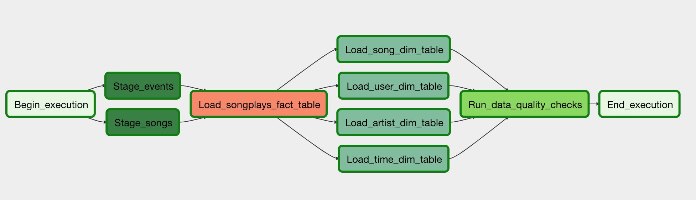
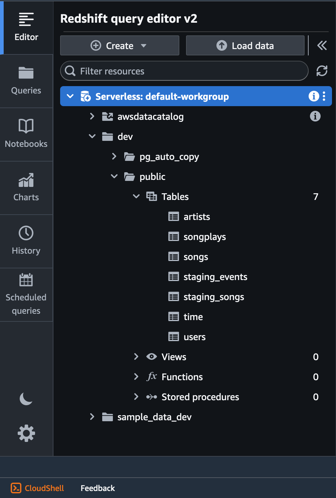
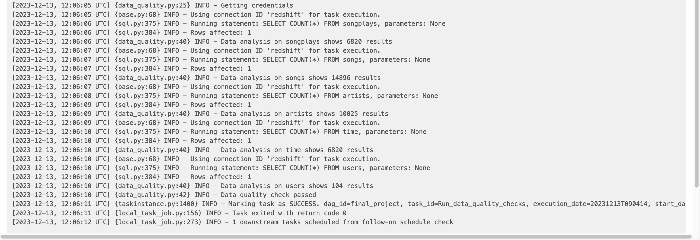

# Project: Sparkify - Data Pipelines with Airflow

---
## Project Overview

A music streaming company, Sparkify, has decided that it is time to introduce more automation and monitoring to their data warehouse ETL pipelines and come to the conclusion that the best tool to achieve this is Apache Airflow.

They have decided to bring you into the project and expect you to create high grade data pipelines that are dynamic and built from reusable tasks, can be monitored, and allow easy backfills. They have also noted that the data quality plays a big part when analyses are executed on top the data warehouse and want to run tests against their datasets after the ETL steps have been executed to catch any discrepancies in the datasets.

The source data resides in S3 and needs to be processed in Sparkify's data warehouse in Amazon Redshift. The source datasets consist of JSON logs that tell about user activity in the application and JSON metadata about the songs the users listen to.

---
## Problem Discription

In this project I fulfilled the complete ETL process by creating a data pipeline using Apache Airflow. Beginning with the Sparkify's raw datasets which are stored in S3 bucket, I formulated then custom operators for inserting automatically the raw data into redshift tables. These table follow a Star Schema.
Finally I ran data quality checks, which are basically simple SQL queries for each table.

The whole process can be conducted and observed via Apache Airflow and has this structure:

The intent for tis for Data Scientists to use the solution to train machine learning models or for Data Analysts to answer dedicated question about the customers behaviour. 

---
## Project Datasets
The provided datasets for customers and music sessions are stored in JSON format in the `udacity-dend` S3 bucket and has following links.
* Log-Data: `s3://udacity-dend/log_data`
* JSON form: `s3://udacity-dend/log_json_path.json`
* Song-Data: `s3://udacity-dend/log_data`

---
## Prerequisites

* Create an IAM User in AWS with the necessary rights.
* Configure a Redshift Serverless workspace in AWS, which is open for external access.
* By using the Query Editor from Redshift Serverless it is mandatory to run the sql queries from `create_tables.sql` to prior create the star schema tables.
  

  

  Tables are created as follows:
  

    
  

  

---
## Repository Structure

### /dags

This folder contains `final_project.py`, which describes the code for the complete DAG. It also descibes different tasks and orders them after appropriate dependencies. 

### /plugins/helpers

This folder contains the `sql_queries.py` that describes the sql statement for inserting the data from staging tables to fact and dimension tables. This code is used by custom operators.

### /plugins/operators

This folder contains all custom operators, whixch are in fact the following: 
  * `stage_redshift.py` contains `StageToRedshiftOperator`, which copies JSON data from S3 bucket to staging tables in the Redshift workspace.
  * `load_dimension.py` contains `LoadDimensionOperator`, which is used for loading data from staging tables to dimension tables.
  * `load_fact.py` contains LoadFactOperator, which is used for loading data from staging tables to fact table.
  * `data_quality.py` contains `DataQualityOperator`, which runs a data quality check by passing a simple SQL query counting the amount of data in each table.
    The following picture is the Airflow output of this check.
  
    

